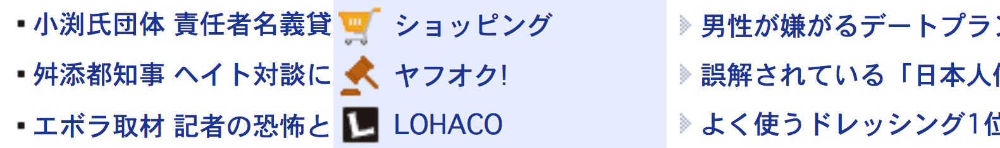

# リストのポッチ

[@Takazudo](https://twitter.com/Takazudo)

----

こういうのどうやって書くか

----

## アイコン置く場合1

[demo](http://codepen.io/takazudo/pen/waqov?editors=110)

* `text-indent` で下げてそこにアイコン置く
* `img` は `middle` 配置
* 右にちょっとマージンで行頭位置揃え
* そこから上下にネガティブマージン で実質画像の高さ消す
* ついでに上にちょい上げる

----

## アイコン置く場合2

[demo](http://codepen.io/takazudo/pen/iBjhl?editors=110)

* `text-indent` で下げてそこにアイコン置く
* `span`を`inline-block`にして`img`囲む
* その中で左右中央寄せにしたり
* 幅高さのバリエーションを持てる
* IE7以下では`inline-block`の 上下ネガティブマージンイマイチなので注意

----

## リストマーカー1

[demo](http://codepen.io/takazudo/pen/JzaKn?editors=110)

* クラシックな左上から背景画像配置
* でも左上基準だとなんかなー

----

## リストマーカー2

[demo](http://codepen.io/takazudo/pen/FDuyB?editors=110)

* `text-indent` で下げてそこにアイコン置く
* `li:before` を `inline-block` にして `middle` 配置
* そこから上下値ネガティブマージンで調整
* IE8〜なので注意

----

## リストマーカー3

[demo](http://codepen.io/takazudo/pen/kvnio?editors=110)

* `a:before` にマーカーを置けばマーカーもクリックできる

----

こんな書き方のほうがいいとかあれば  
おせーてください

